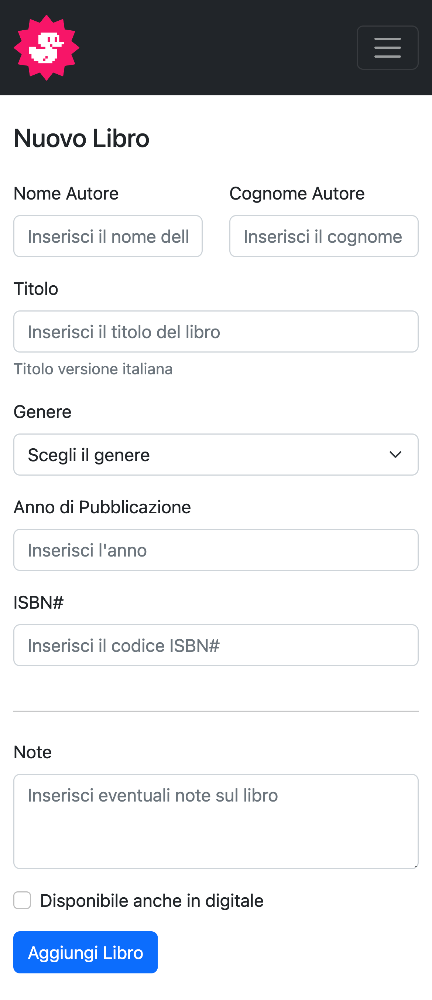
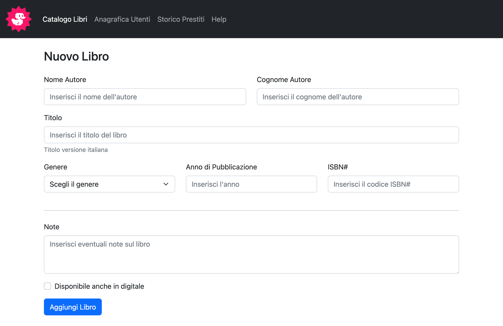

# HTML-CSS-BOOSTRAP-DASHBOARD

 Responsive dashboard book list layout built using Boostrap 5 framework frontend.

 # Demo Live

[🌐  **Click here for demo**](https://daviderocco85.github.io/html-css-boostrap-dashboard/)

# Target

Let’s recreate a responsive dashboard layout similar to the control panel of a hypothetical web application using Boostrap 5

# Additional target

Add a new dashboard page containing a form for adding new books.

# Technical notes

A JavaScript file is included for Bootstrap form validation.

# HTML-CSS-BOOSTRAP-DASHBOARD screenshot example
#### Mobile

#### Tablet

#### Desktop

# New book page form screenshot example
#### Mobile

#### Desktop

 